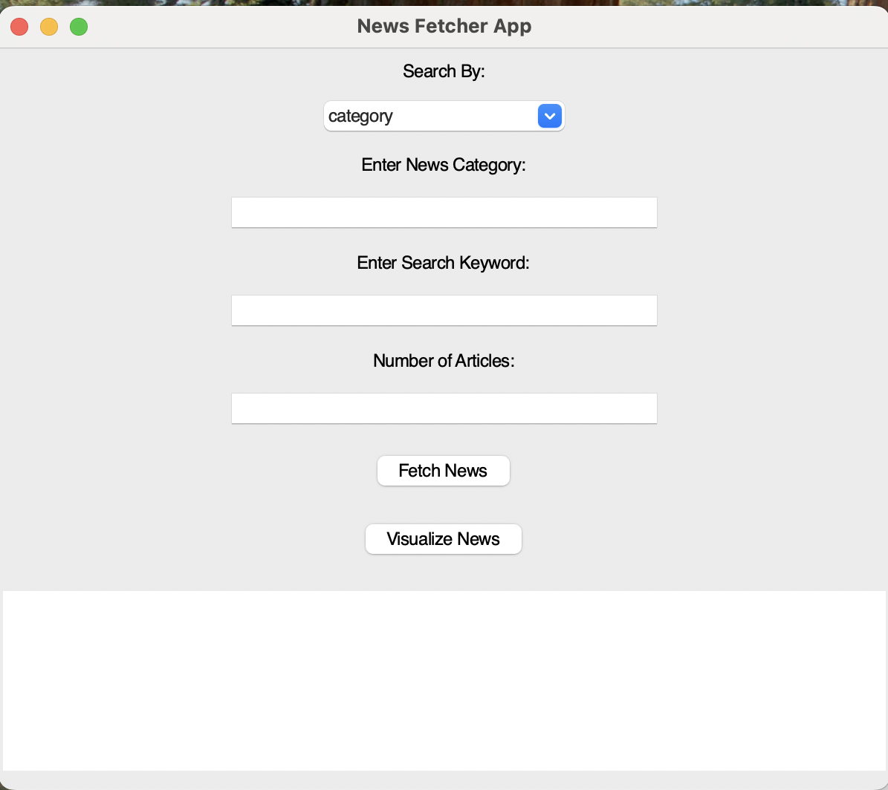
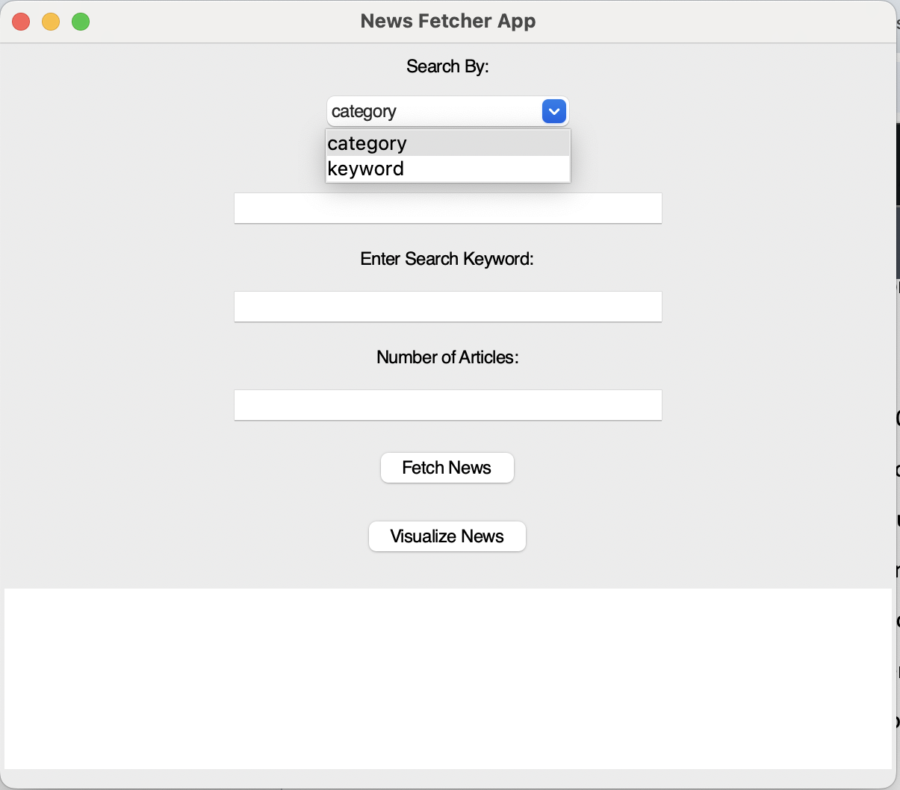
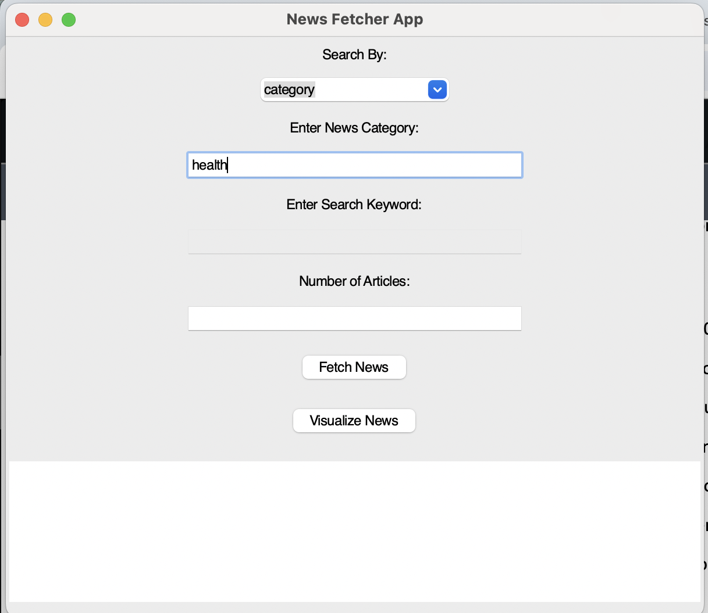
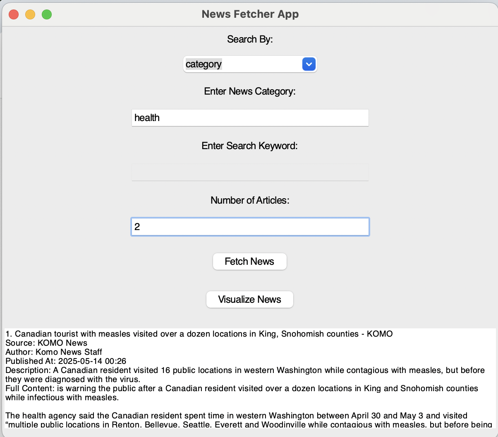
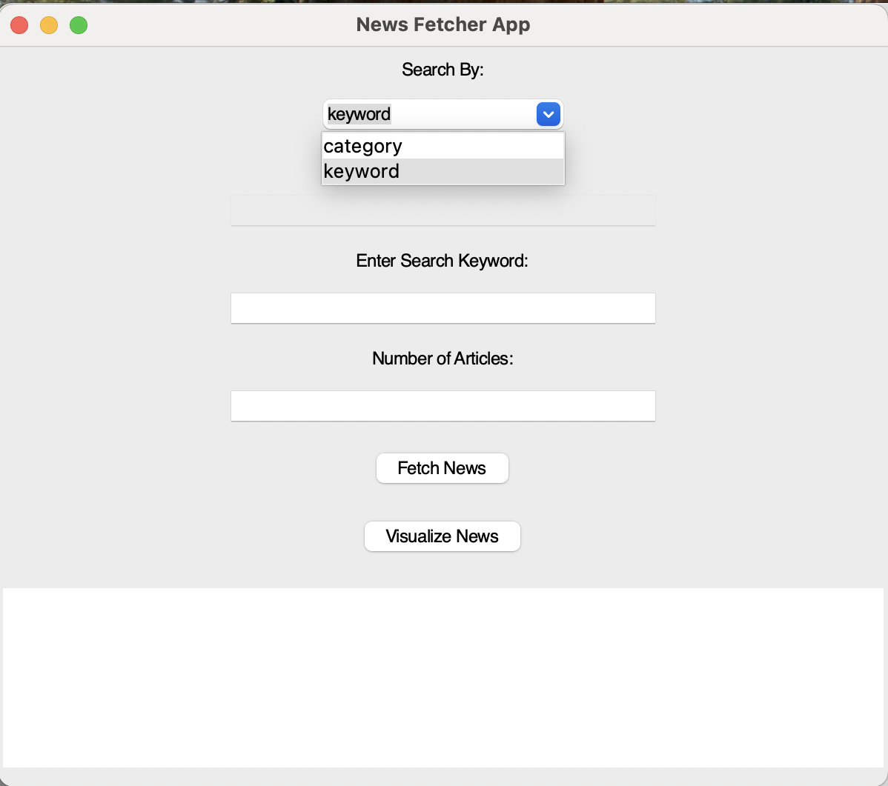
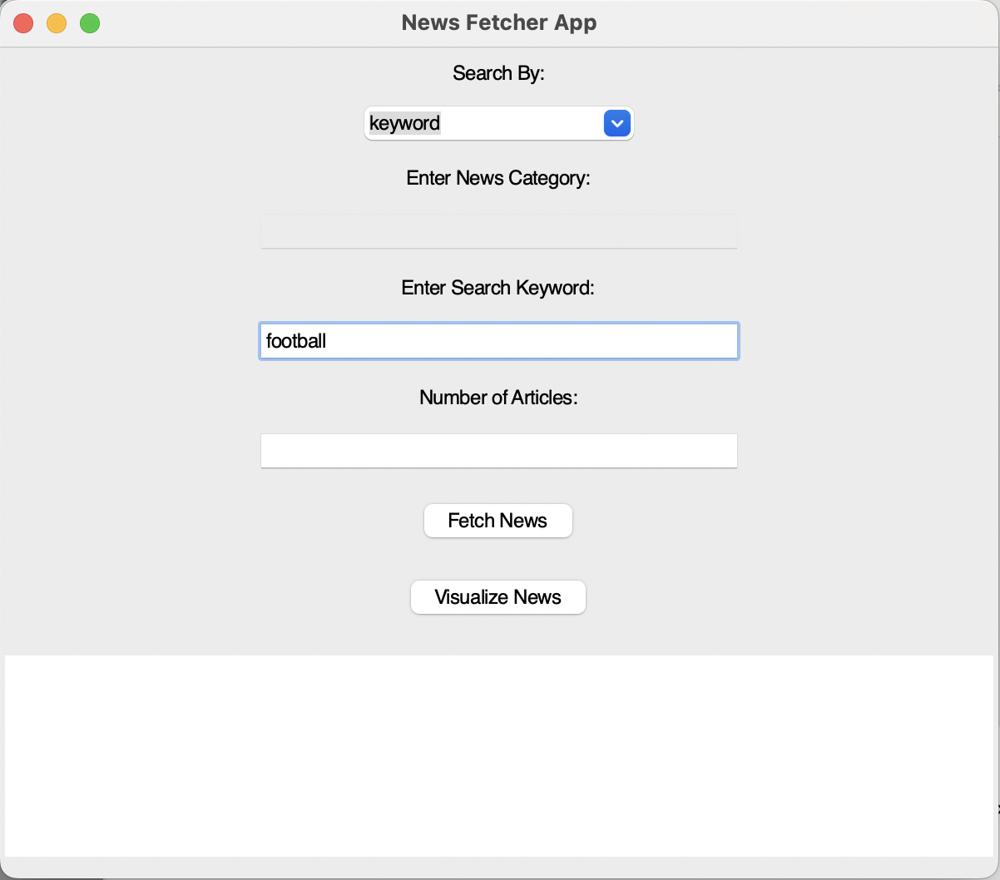
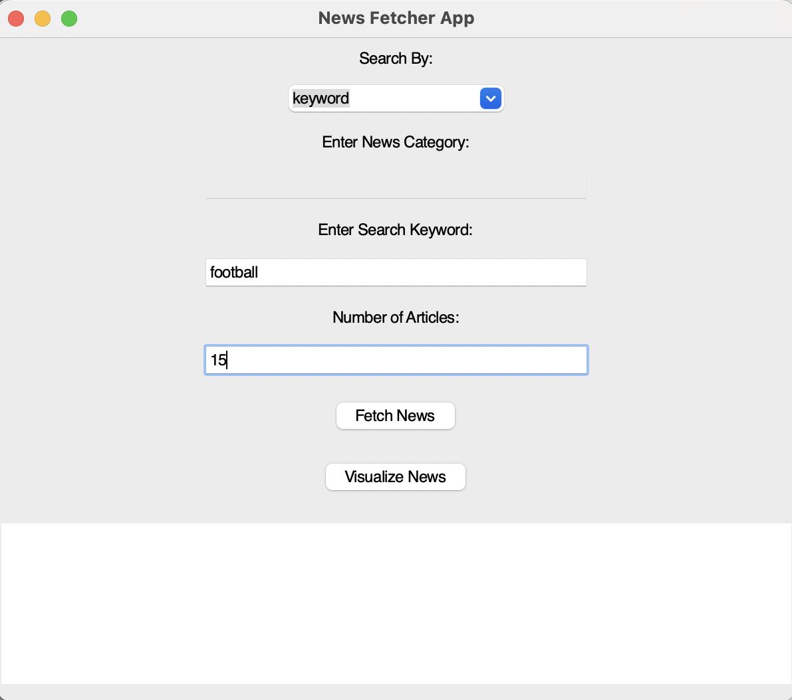
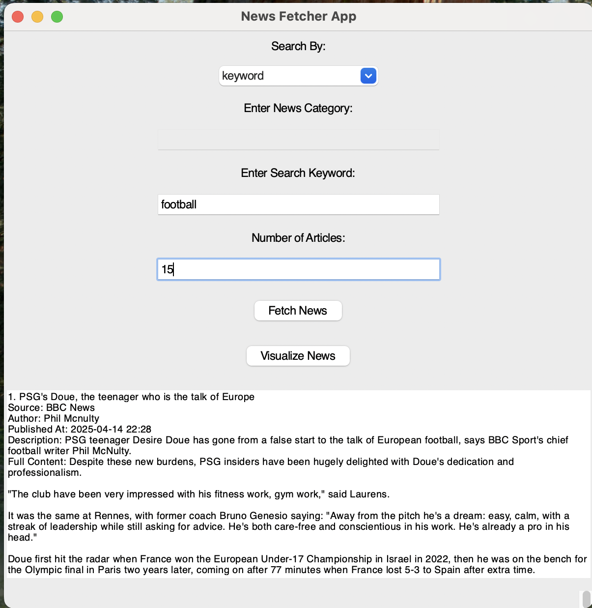
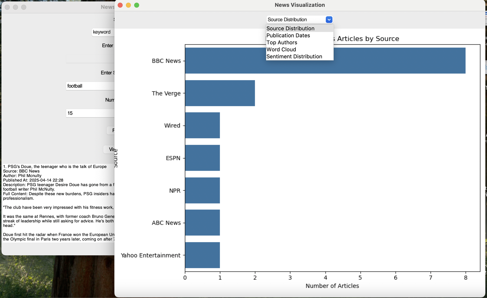

# 📰 Python Information Aggregator

_A GUI-based news aggregator using Web APIs, Web Scraping, OOP, and Unit Testing_











---

## 📌 Project Overview

This Python project is a **news aggregation tool** that fetches, scrapes, processes, and visualizes articles from multiple online sources. It combines:

- **Web APIs** (e.g., NewsAPI)
- **Web scraping** (with BeautifulSoup)
- **Object-Oriented Programming** for modular design
- **Unit testing** for reliability
- **Tkinter GUI** for a clean and interactive desktop application
- **Data caching** and **visualizations** to enhance performance and usability

---

## 🎯 Key Features

### ✅ API Integration

- Uses **NewsAPI** to fetch top headlines from various global sources
- Category- and keyword-based search

### ✅ Web Scraping

- Extracts full article content, authorship, and publication date using **BeautifulSoup**
- Enhances basic API data

### ✅ Object-Oriented Design

- Organized into reusable classes:
  - `NewsFetcher`: API communication
  - `ArticleScraper`: Web scraping logic
  - `NewsVisualizer`: Chart generation
  - `NewsApp`: Tkinter GUI controller

### ✅ Caching System

- Avoids redundant API calls
- Speeds up repeated queries
- Local JSON storage

### ✅ Graphical User Interface

- Built with **Tkinter**
- Users can:
  - Select a news category
  - Choose number of articles
  - View results in a scrollable text area
  - See visualizations based on data

### ✅ Visualizations

- Built with **Matplotlib**
- Shows article distribution by source
- Topic frequency over time

### ✅ Unit Testing

- Implemented using `unittest`
- Tests for:
  - API responses
  - Scraping output
  - Error handling scenarios

---

## 🧰 Technologies Used

- Python 3.10+
- Tkinter
- Requests
- BeautifulSoup
- Matplotlib
- Unittest
- JSON

---

## 🖥️ GUI Preview


---

## 🚀 How to Run

```bash
# Clone the repository
git clone https://github.com/yourusername/news-aggregator.git
cd news-aggregator

# Install dependencies
pip install -r requirements.txt

# Run the app
python main.py
```

## 🚀 Code Structure

📦 news-aggregator
├── main.py # Launches the GUI
├── news_fetcher.py # Handles API calls
├── tests/
│ └── test_news_app.py
├── assets/
│ └── screenshot.png
├── README.md
└── requirements.txt
